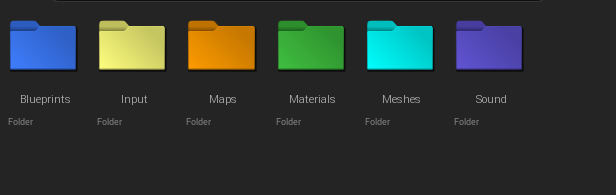
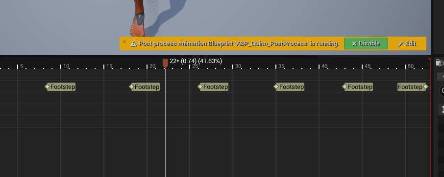
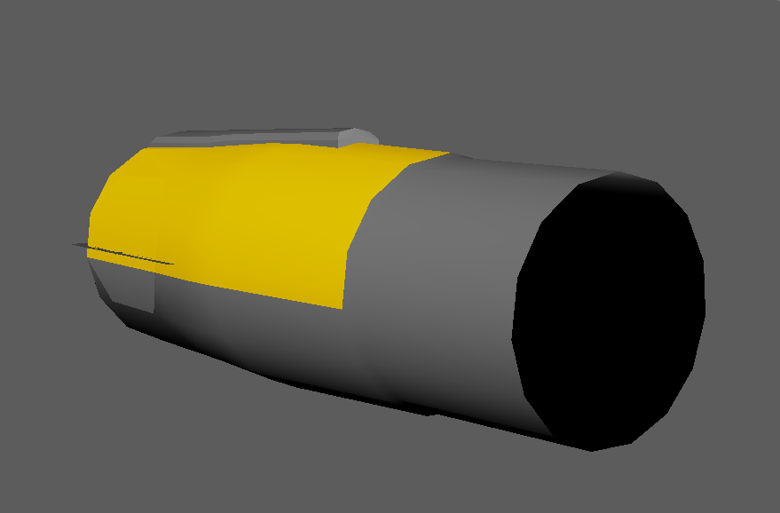
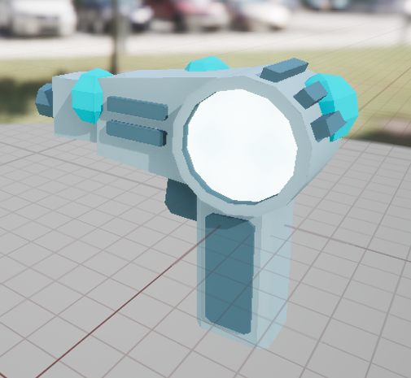
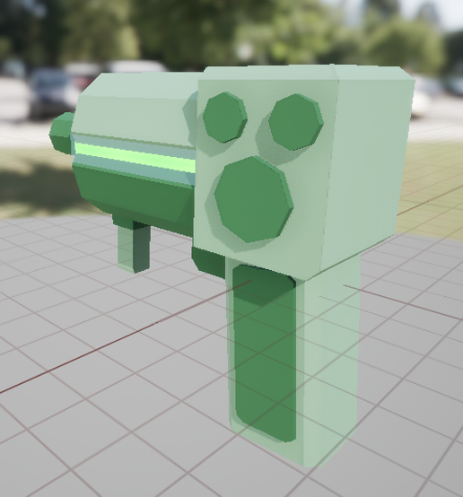
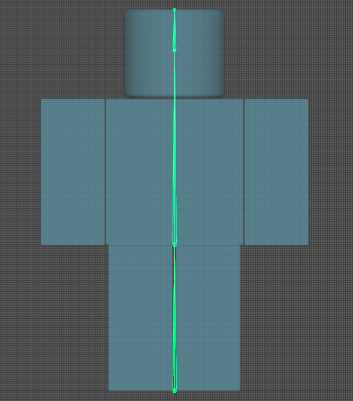
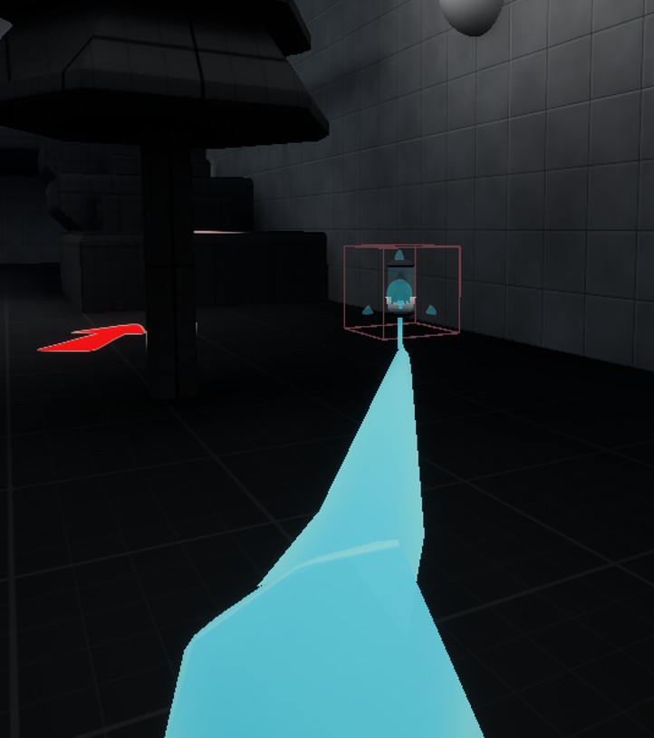
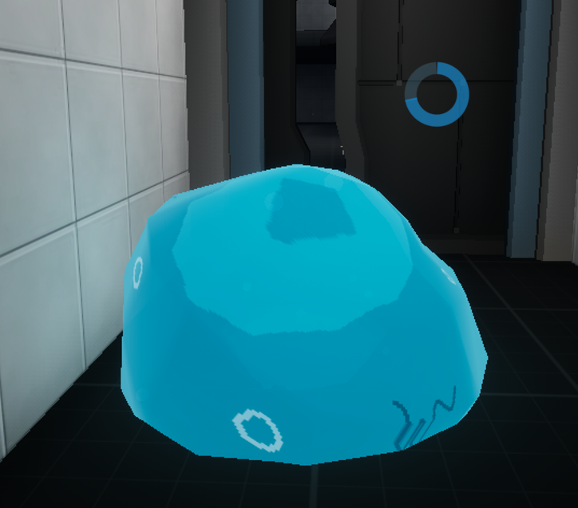
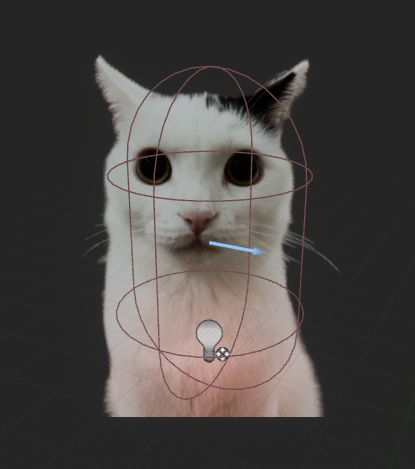
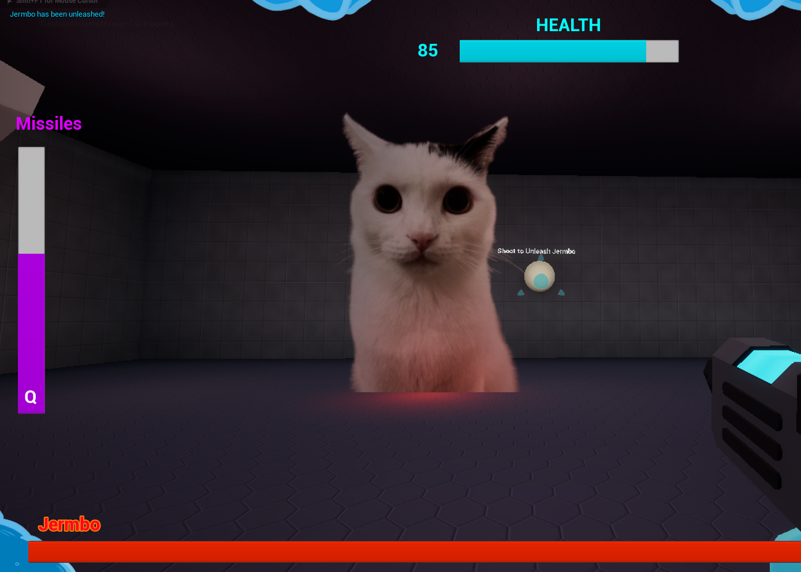

# Development Journal

# Advanced Games Programming

## George Scanlan (2202038)

### Links to Github Repositories

[Documentation](https://github.com/11gscanlan/Advanced-Game-Programming_Documentation)
(Weekly Tasks can be found on the documentation repository, as well as declared assets)

[Source Code](https://github.com/11gscanlan/AdvancedGamesProgramming_MetroidPrime)

---

# Week 1

### Editing the initial Third Person character

- Attaching Camera Boom to mesh's head for viewbob
- Editing the physics, making the character floatier with better air control

### Creating File structure

To make the file structure organised and easy to navigate, I made a  series of base folders where I would organise everything into. Such as Blueprints, Materials and Meshes. I then colour coded them to their respective colours to keep them organised.

---

### Adding a separate spring arm and then adding the viewmodel / arm cannon
- I created a seperate spring arm which I attached to the player's camera to act as the viewmodel. I made sure to check the "use pawn control rotation" box as that way, the spring arm would be constantly facing in the direction the player is looking.

- From there I added the mesh, which was just a cube, to use as the positioning for where the arm cannon would go.

---
### Character sounds
I wanted to create movement sounds for the player, so I went into the animation graph and added a series of "anim notify" flags that played footstep noises when triggered. I did the same for the anim graph for landing from falling, making a seperate noise trigger for that too.

---
### Video Showcase

[This video](https://youtu.be/WTIQAuz8Gws) shows off my progress at the end of the first week.

---

# Week 2

### Arm Cannon mesh

---

### Power Beam

I created the default fire mode by first creating a modular script that spawned in the projectile I wanted at the end of the arm cannon, which I could then later change to spawn different projectiles once I added the other beams and their charged variants.

<iframe src="https://blueprintue.com/render/o4-w7b1d/" scrolling="no" allowfullscreen></iframe>

---

### Charge Beam
I created the Charge Beam by using a seperate input that used left click assigned to a timeline. I like using timelines for creating systems that need either a short duration of what is essentially "event tick", or a delay that can be interrupted.

In this case I used the latter. Holding down left click would start timeline set to 0.5 seconds which, when finished, would set a variable to true saying that the beam was fully charged. After which, releasing left click would check to see if the flag is true and, if so, fire the charge beam.

<iframe src="https://blueprintue.com/render/tu_jx-2g/" scrolling="no" allowfullscreen></iframe>

---

### Missiles
Creating missiles was as simple as recreating the primary fire script, however I also made an integer variable that tracked the ammo counter, and wouldn't fire if the player was out of missiles.

<iframe src="https://blueprintue.com/render/h5q4xvpo/" scrolling="no" allowfullscreen></iframe>

---

### Switching Beams

I created an enumerator that tracked which beam state the player's arm cannon was in, which would be used at the point of firing the arm cannon to switch which beam to fire.

After that, I created a quick script that changed the beam. It is controlled by hitting the 1,2,3 or 4 keys to execute the 4 different nodes to swap beams.

<iframe src="https://blueprintue.com/render/p0tb1egw/" scrolling="no" allowfullscreen></iframe>

---

The other 3 beams initially were just copies of the default beam, but with the colour of the beam changed.

### Visor Texture Widget
For the visor, I created a user widget that the player character created at the "event begin play" node. Most of the work on the visor was visual work, without many mechanics actually added.

## Project State Demonstration Video

[Project State Week 2](https://youtu.be/IUVH7G2YVbI)

---

# Week 3

## New Power Beam Model
I wanted to create a new arm cannon model, so using the metroid prime arm cannon as a reference, I... bascially just recreated it in Maya.

I'll be brief for this since it was a rather unnecessary side task to acomplish and I really should've been focused on the mechanics, but creating the mesh allowed me to try out animation blueprint states on the mesh.

For the animation blueprint, I created switches between 4 different states, which mostly just boiled down to several "Is arm cannon state = 1" flags. So, for example, if the arm cannon state was set to the Wave Beam, aka State 2, then it would switch to the wave beam state.

## New Beam VFX
With the new arm cannon, I changed the VFX for the arm cannon, including adding a muzzle flash effect.

[Video Demonstration of Arm Cannon and New Beam VFX](https://youtu.be/ZAQUvjmRYOM)

## Morph Ball

For the morph ball, I created two different functions, one which could be used to toggle the morph ball physics, shrink the player's size and make the camera go third person;

<iframe src="https://blueprintue.com/render/do_n9stf/" scrolling="no" allowfullscreen></iframe>

And another node specifically when attempting to exit the morph ball which would box trace above the player to see if they were in an enclosed place, and prevent the player from exiting the morph ball if they were.

<iframe src="https://blueprintue.com/render/7owpqxgy/" scrolling="no" allowfullscreen></iframe>

[Morph Ball Demonstration](https://www.youtube.com/watch?v=oIiFYUPg1F4)

## Morph Ball Tunnels

To create tunnels that the player can move through, I created an actor with a spline, then in the construction script, I added a spline mesh component.
Then by utilising a for loop set to the total number of spline points, find the location and tangent at each spline point, and set the attach and end point to them. This meant whenever I moved the spline or added a new point, it would create a new tunnel mesh that bent to fit the spline.

<iframe src="https://blueprintue.com/render/nsb6l36p/" scrolling="no" allowfullscreen></iframe>

## Targeting System

---

# Week 4

### Aim Lag Visor + Crosshair
To recreate the HUD having a lag effect, I created a Widget actor to use instead of the widget I had on the player's viewport. I set it to move to the player camera's view every tick, and added a spring arm with rotation lag so the HUD would lag slightly, which required I go back and make a new HUD with a larger size so more of it would be visible when it swayed, instead of visibly cutting off.

### Fixed Tunnel Camera

How To Make A Spline-Based Side-Scroller Camera In Unreal Engine (2023) At: https://www.youtube.com/watch?v=ZmIzHtglnMM (Accessed  21/10/2024).

### Face Reflection
The next feature I wanted to have was the player's face reflecting on the visor if they were in close proximity to a missile explosion.
I took a photo of my face to use as a prototype face proof of concept.

## Beginning the process of removing the Nintendo assets
During the standup for this week, I reflected on what I had created so far, and realised I was slowly exhausting the ideas I had for the different mechanics, though one large thought was brought up which I had been figuring for a while; that Nintendo could *probably* sue me if I published the game on Itch.io, especially since a lot of the mechanics I was making are directly inspired by the mechanics from Metroid Prime. So a large hurdle I now had to tackle was making it so that wouldn't happen, I had to retheme the game and make it something unique.

I made a table of what needed to be replaced, that way I could keep track of what needed to be changed;

| Asset | Asset Description |
| ------ | ------ |
| Morph Ball | The Morph Ball needs to be replaced with something new, possibly changing the mechanics |
| Arm Cannon | The Player's arm cannon could be switched out with multiple weapons instead of an arm cannon to make it less comparable |
| Wave Beam | I could retexture and change the wave beam particle effects to change it into arcs of electricity to make it different. |
| HUD | The HUD needs to be retextured and reorganised to change it as currently it is copying the general layout from Metroid Prime, I could potentially keep the lagging aspect if I retheme it |

So I began brainstorming, my immediate thoughts were directed at the Morph Ball, as that ability is a staple of the metroid series, I needed a way to have a mechanic similar to that, without being a direct copy. I remembered some old Newgrounds flash games I used to play, one of which being Slime Labs; that has the player rolling around and platforming as a slime ball, squeezing through vents, and navigating the environment. So I had a great idea; to retheme the player character into a slime humanoid, and turn the morph ball into the player reforming back into their original slime ball form, allowing them to roll around and fit into smaller gaps that they couldn't normally.

---
### New Morph-Ball: The Slimeball
I used a material I had created last year for the technical art unit, where the mesh's faces extrude towards nearby surfaces to replicate the extrusion a slime ball would face when pushed against the ground. It did this by using a combination of a "distance to nearest surface" node, a "VertexNormalWS" node, and several other math-ey nodes.

<iframe src="https://blueprintue.com/render/q7kj54jb/" scrolling="no" allowfullscreen></iframe>

---
After creating the slimeball material, I changed the image of the face reflection to one I drew which better resembled a slime.

## Replacing the Weapons
My focus was now on the weapons. I had to split the power beam into 4 unique weapons and also alter what they do to make them unique instead of copying Metroid Prime.

### Power Beam
I decided to change the power beam into a basic sci-fi energy pistol.
I created a basic mesh in Maya to demonstrate what I was aiming for. As the general idea for the new weapon system was multiple different looking guns instead of an arm cannon that transformed between 4 different states.

After that I simply swapped out the arm cannon for the new mesh, and changed the projectile to a blue cylinder.

---
### Wave Beam
For the Wave Beam I created a sciency electric gun that has different prongs chanelling electricity into the center. I changed the properties of the gun so it quickly fired while holding down left click.

---
### Ice Beam
For the Ice Beam, I created a gun that was based around chanelling cryogenic energy in the back, which is then fired out of the barrel in the form of condensed ice bricks which explode on contact with walls and freeze enemies.
The projectile was therefore kept largely the same as there was no need to change anything.

---
### Plasma Beam
The Plasma beam saw the most drastic change, I changed it so it fires arcing globules of acidic goop that bounce on walls before exploding dealing splash damage.

---
### Missile Launcher
For the missile launcher, I thought the best solution was to have the rocket launcher be a seperate part of the player's arsenal that they can use independently to the weapons.

I based the new rocket launcher off of Doom Eternal, which has a shoulder-mounted rocket launcher. So I moved a mesh into the top left corner of the player's view and set that to be the origin point of where missiles are shot from.

---
### Switching Guns
With the new weapons created, I changed the script for swapping weapons so instead of changing an enumerator to swap an animation state, it would directly swap the mesh and play an animation of the player drawing a new gun.

<iframe src="https://blueprintue.com/render/_c3e_gb3/" scrolling="no" allowfullscreen></iframe>

---

# Week 5

## First Build
Our lecturer requested we create a build of our project, as we should be doing that regularly. My first build turned out okay except for strange visual flickering on the player's guns, which I fixed by enabling VSync in the game's configuration as it also caused a lot of visual tearing on the default unreal grid material I was using.

## New Mesh and Walk Cycle
Liam was wandering around the class, and when he looked at my project, suggested I make the walk cycle look more slime-ey, as currently it looked like a regular human walking, and not a slime sloshing around. So I decided to change that by making my own custom mesh.
I designed the proportions after a roblox character, but it didn't matter too much since you were nver going to be able to see the player's mesh, it was simply to use for first person animations such as the walk cycle.
I created, rigged and animated the mesh in Maya, and then swapped it out as the new character mesh.

---

https://forums.unrealengine.com/t/edge-glow-applying-to-entire-surface/127918
I read this link and found the word "Fresnel", so I inputted that into the material node and it gave me exactly what i wanted yaaay!

https://www.raylib.com/

## Lesson Task: Data Driven movement system

# Week 6

## Project Development

Since I finished changing the art assets to make my game unique, I wanted to move away from the art aspect of my project to continue focusing on the devlelopment of the mechanics over the next two weeks. I had three primary mechanics I wanted to add, that being the Inventory System, Enemy AI, and Environmental Objects such as Doors and Lab Vents.

### Enemy AI
I first chose to further develop the Enemy AI so it could actually move and attack the player.

I created a behaviour tree, and two task nodes. One task node was set to wander to a random point, and the other made the enemy shoot 3 projectiles at the player.

### Water
I created a box collision that, when the player entered, set a flag that the player was underwater. In the player character's event tick, I would activate a node that damaged the player every second they were in the water.

<iframe src="https://blueprintue.com/render/yrtw-8ir/" scrolling="no" allowfullscreen></iframe>

### Rope Swinging
I wanted a system where the player could swing on ropes. It was intially part of my feature creep, but I had finished all of the ideas I wanted to add.
I experimented with physics-based cable systems, but they didn't work properly with what I wanted to do.

When the player is in range of a hook, they must press and hold E. It will then create a hook actor, which will repeatedly swing the player back and forth in a simulated swing animation.
When the player releases E, they will be launched in the direction they are currently swinging.

<iframe src="https://blueprintue.com/render/nypmyf39/" scrolling="no" allowfullscreen></iframe>

---

# Week 7

### Items
I wanted to create pickups the player could collect to restore both energy and also missiles. So I created a static mesh with a box collision attached. I also created a boolean value which would swap the mesh and grab function between health and missiles.

<iframe src="https://blueprintue.com/render/fdbz_7dl/" scrolling="no" allowfullscreen></iframe>

When the player was in FPS mode, I also had it cast to the player mesh to play a grab animation where the player appears to grab the ammo before stashing it over their shoulder.
The animation would be skipped in Slimeball mode since the player is in third person.

<iframe src="https://blueprintue.com/render/q2e7-fse/" scrolling="no" allowfullscreen></iframe>

---
### Slimegrab
I wanted to add a system that replicated the mechanic from Half-Life: Alyx where the player can grab ammo and health pickups from long range. To do this I first created a line cast node from the player character. I then created a blueprint interface to place on the consumables so that the player can grab them.

<iframe src="https://blueprintue.com/render/c2o26uza/" scrolling="no" allowfullscreen></iframe>

After that, I created the grab code in the consumable item. The main node is a 'suggest projectile velocity custom arc' node, calculating how to launch from the item's location to the players. It then launches the item by the calculated impulse.

I then added a second visual node that plays a grab animation, and spawns a cable component that attaches itself to both the ammo and the player's hand, thus giving the appearance of a slime tendril firing from the player's hand to grab the ammo from long range.

<iframe src="https://blueprintue.com/render/adsg_4od/" scrolling="no" allowfullscreen></iframe>

---
### Spindash

### Door

### Inventory System

---

# Week 8
This week was about getting people to test our games. Students were bribed with biscuits to come and test our games. So it was a very good opportunity to recieve feedback about many aspects of the game.

## Testing Feedback

| Category | Feedback |
| --- | --- |
| Slimeball | Fun to use, the added movement abilities are nice. However the player may end up overusing the ability due to how much better it is at movement. Therefore it may be better to make it a time-limited ability or make the slimeball state the default, and have the guns be activated |
| Controls | Movement in the FPS state is too slow, some control aren't explained very well (Locking on to enemies and rope swinging), level is too open-ended so the player might not be able to experience everything. |
| Progression | The player is able to skip certain segments when in the slimeball ability due to how fast it is, so important mechanics should be taught to the player in a way where they can't accidentally skip them |
| Rope Swing | Fun to get right, but many players struggled with getting the timing for activating it right, and also didn't know that you had to hold down E, so they would activate the rope swing, then immediately stop swinging. Which lead into another complaint that since the first rope swing could be skipped, the next "first" tutorial was over a bottomless pit that killed the player, which was a fairly harsh punishment for failing on the second try. |

With this feedback in mind, I set off to fix some of the bigger issues that players had with my game.

## Making the Slimeball a timed ability.
In order to make the slimeball a timed ability, I created a collapsed node graph attached to the event tick which, whilst the player was in the slimeball state, drain a float variable until it reached 0. Then, after reaching 0, it would attempt to force the player out of the slimeball state. 

Initially it would force the player back into FPS mode even when hiding in tunnels, so I changed the script so when attempting to exit the slimeball state, it wouldn't do so if the player was hiding in a tunnel, it would only force them out after they left the tunnel.

<iframe src="https://blueprintue.com/render/hrs-uxca/" scrolling="no" allowfullscreen></iframe>

I then created a circular progress bar in the player's widget that tracks the player's energy, so the player has a visual indicator of how long they have left before they exit slimeball mode.

## Boss Fight
To give the testers an objective, I created a boss arena, and a boss enemy. The boss in question was originally just a larger version of the AI but with more health. I took inspiration from Ross using Maxwell in his project and decided to swap out the boss' mesh for a PNG image of Jermbo, an image of a cat.

The only main differences were that you couldn't freeze Jermbo, and instead of dying immediately, it starts a timeline that causes Jermbo to explode violently for about 3 seconds before disappearing.

When testing the game, viewers seemed to enjoy the sudden, dramatic appearance of a cat PNG that started quickly moving around the boss arena and attacking the player, so I got some favourable feedback regarding Jermbo.

## Win Screen
When Jermbo died, I wanted that to be the win-state for the player, so in the death script after Jermbo was done exploding, I had him create a widget of the win screen.

<iframe src="https://blueprintue.com/render/6gb4wjga/" scrolling="no" allowfullscreen></iframe>

---

# Week 9

### Fix Rope Swing
To fix the rope swing mechanic, I decided to make it a scripted swing that only requires the player to press E once and not hold it, that way the swings would be the exact same angle every time, and would be easier to pull off.

<iframe src="https://blueprintue.com/render/9mcuie7p/" scrolling="no" allowfullscreen></iframe>

### Homing Attack
I wanted to give the slimeball a dash attack that made them dash towards nearby enemies.

I first created a script that looked for the nearest enemy closest to the player. It would get every actor with the blueprint interface, and decide if each one was closer than the previous. The first one was compared to a distance of 1000, since I wanted the homing attack to be close range.

<iframe src="https://blueprintue.com/render/f7h96apf/" scrolling="no" allowfullscreen></iframe>

I then wanted to create a search to see if the actor was on-screen. So I used the "convert world location to screen location" node, and, comparing it to the viewport size, check if the actor's screen location was actually on the screen. If not, then it wasn't registered as a valid actor to homing attack.

<iframe src="https://blueprintue.com/render/u2gqvaeb/" scrolling="no" allowfullscreen></iframe>

After successfully finding the target actor, it then simply launches the character towards the target actor.

<iframe src="https://blueprintue.com/render/_rxl-ftn/" scrolling="no" allowfullscreen></iframe>

---

# Week 10

As week 10 was the final week, I spent most of my time working on the development journal as well as my theory essay.

During the lesson I decided to go back to the weekly tasks for week 2 and 5 as I hadn't completed those. Initially I hadn't finished Week 2's work as it required a lot of typing and the PC I was working at had a very sticky keyboard and it made typing really annoying.

After that it was just a case of finishing everything to the best of my ability and submitting it for the handin deadline.

## Final Reflection
Overall, I felt I got quite a lot done in the 10 weeks, and got a sizeable prototype created in the 10 weeks.

If I would do anything differently, I would've made sure not to fall behind on the Development Journal work, as not keeping track of things early on will inevitably mean that I end up forgetting them later on, it also would mean less work closer to the hand-in point.

# Declared Assets

GameCube - Metroid Prime - Sound Effects - The Sounds Resource (s.d.) At: https://www.sounds-resource.com/gamecube/metroidprime/sound/3672/ (Accessed  01/10/2024).

Jermbo but cropped..png (2024) At: https://regretevator.fandom.com/wiki/File:Jermbo_but_cropped..png (Accessed  25/11/2024).

Stock Explosion Image (s.d) At: https://gifer.com/en/2a9n (Accessed  04/11/2024).
