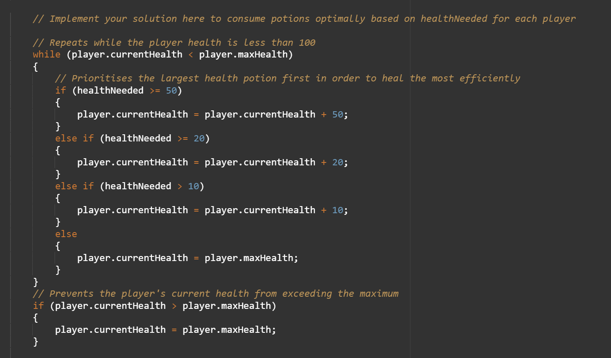
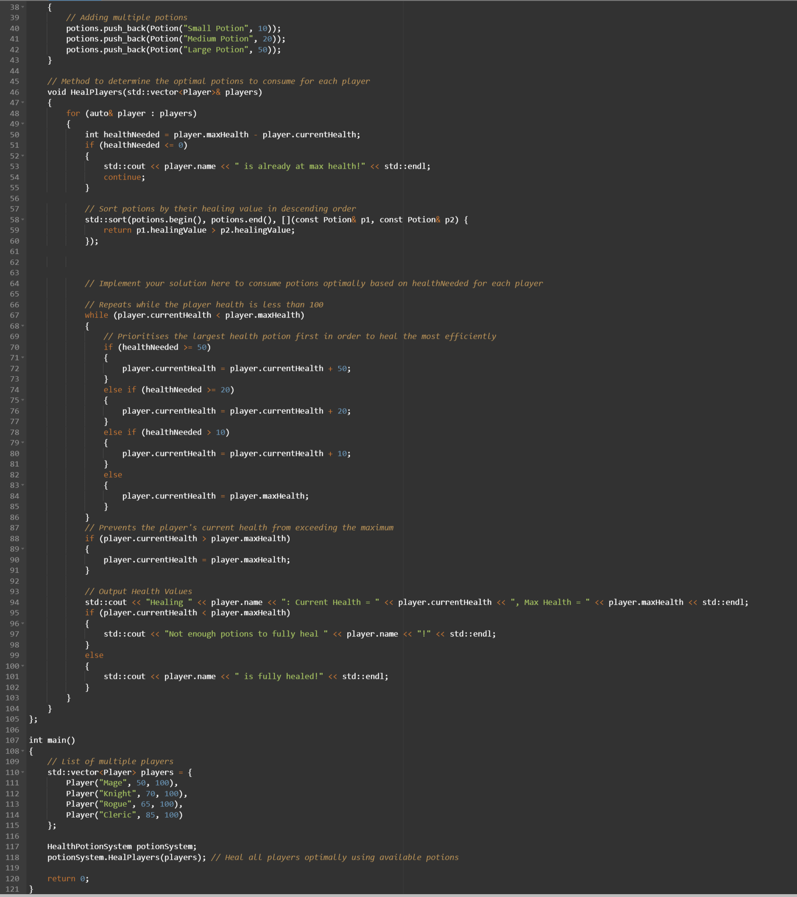

## Task 3: Health Potion Optimisation (Pair Programming)

### Research

https://www.tutorialsteacher.com/csharp/csharp-if-else

---

The task for this week was Health Potion Optimisation, we were told to create an algorithm that uses Health potions as efficiently as possible.

The task was pair programming with Maddie.

For the task, we created a while loop tied to whether the player's current health was lower than their maximum health.
Within that we created some else if statements so that the player wouldn't consume larger health potions if they didn't need to. So if they only needed to heal 30, they would first drink a 20 health potion, then a 10.

After that, we tried to add a system where it would track how many of each potion type were consumed and output it to the player, but we couldn't get it working correctly.

