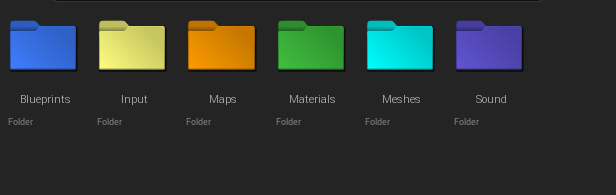
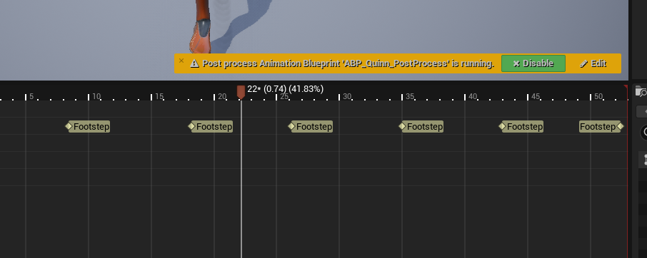

# Week 1

### Editing the initial Third Person character

- Attaching Camera Boom to mesh's head for viewbob
- Editing the physics, making the character floatier with better air control

### Creating File structure

To make the file structure organised and easy to navigate, I made a  series of base folders where I would organise everything into. Such as Blueprints, Materials and Meshes. I then colour coded them to their respective colours to keep them organised.

---

### Adding a separate spring arm and then adding the viewmodel / arm cannon
- I created a seperate spring arm which I attached to the player's camera to act as the viewmodel. I made sure to check the "use pawn control rotation" box as that way, the spring arm would be constantly facing in the direction the player is looking.

- From there I added the mesh, which was just a cube, to use as the positioning for where the arm cannon would go.

---
### Character sounds
I wanted to create movement sounds for the player, so I went into the animation graph and added a series of "anim notify" flags that played footstep noises when triggered. I did the same for the anim graph for landing from falling, making a seperate noise trigger for that too.

---
### Video Showcase

[This video](https://youtu.be/WTIQAuz8Gws) shows off my progress at the end of the first week.