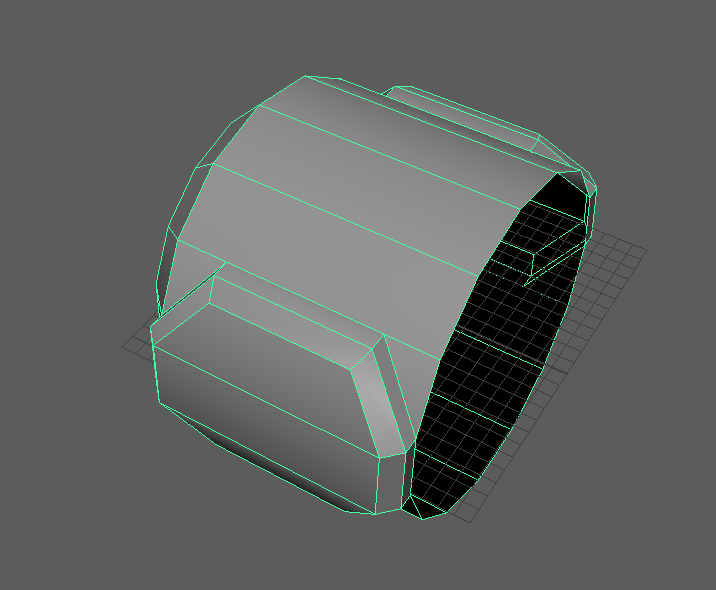
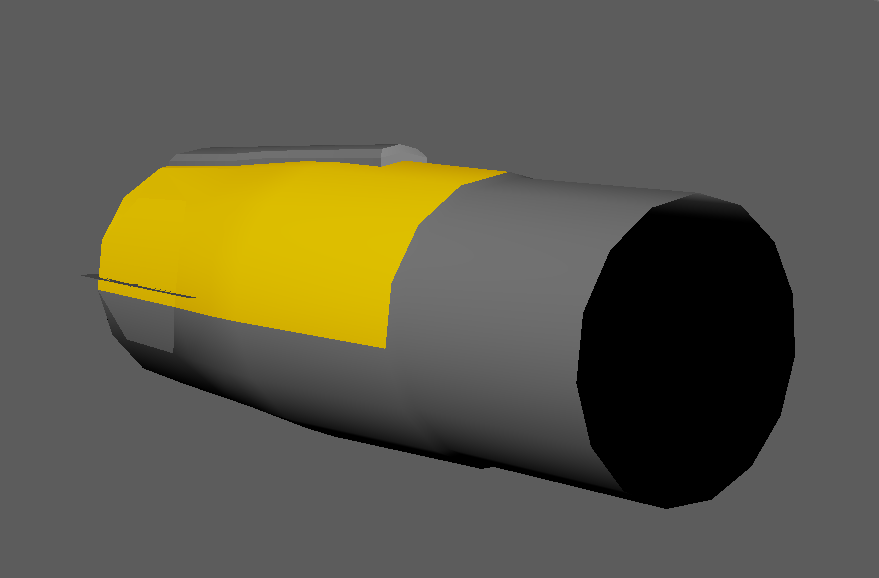
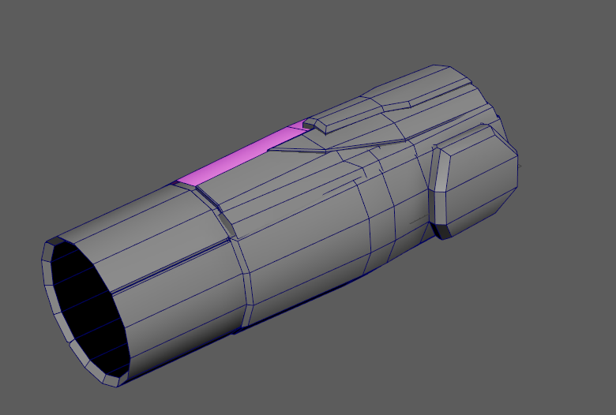
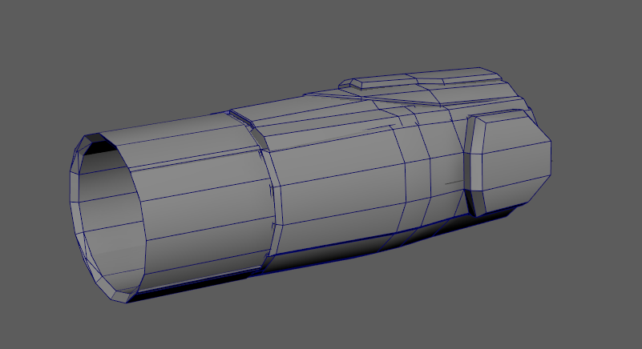
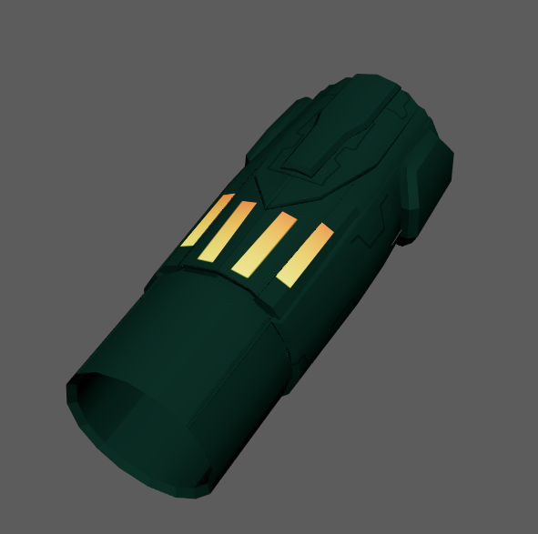
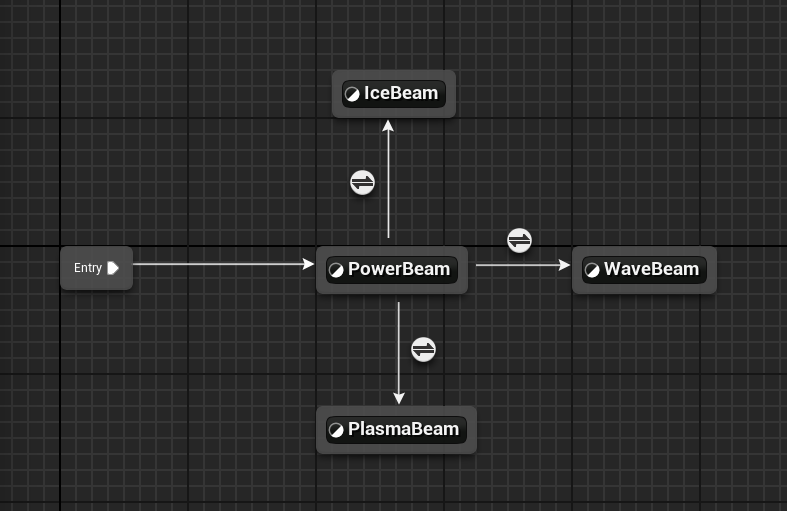

# Week 3

## New Power Beam Model
I wanted to create a new arm cannon model, so using the metroid prime arm cannon as a reference, I... bascially just recreated it in Maya.

I'll be brief for this since it was a rather unnecessary side task to acomplish and I really should've been focused on the mechanics, but creating the mesh allowed me to try out animation blueprint states on the mesh.

For the animation blueprint, I created switches between 4 different states, which mostly just boiled down to several "Is arm cannon state = 1" flags. So, for example, if the arm cannon state was set to the Wave Beam, aka State 2, then it would switch to the wave beam state.

## New Beam VFX

## Morph Ball

## Morph Ball Tunnels

## Targeting System

## Increase Near-Clip Plane

## Charge Beams

## Aim Lag Visor