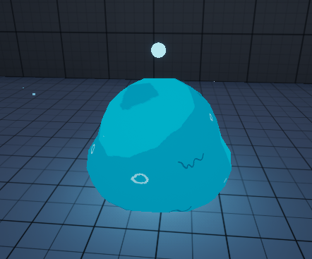
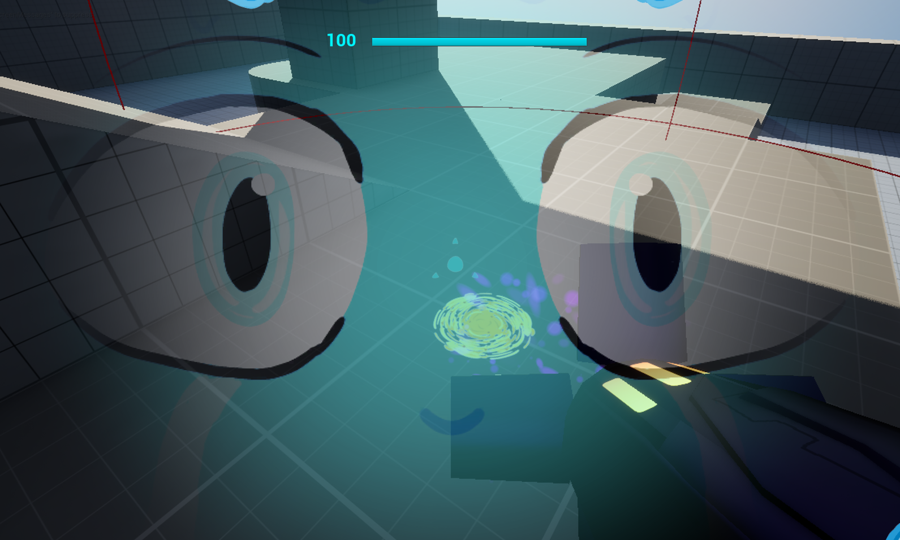
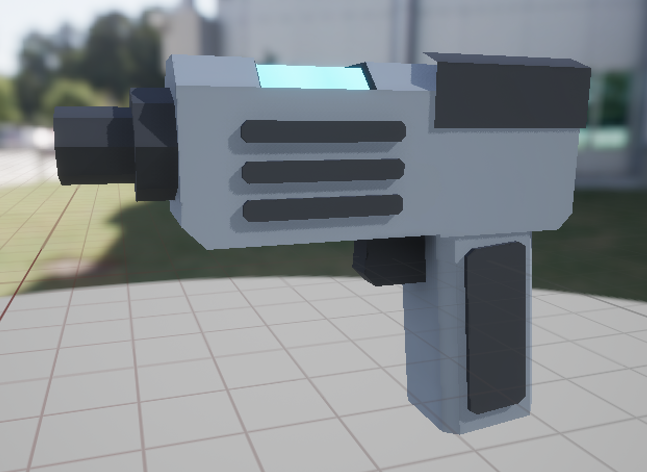
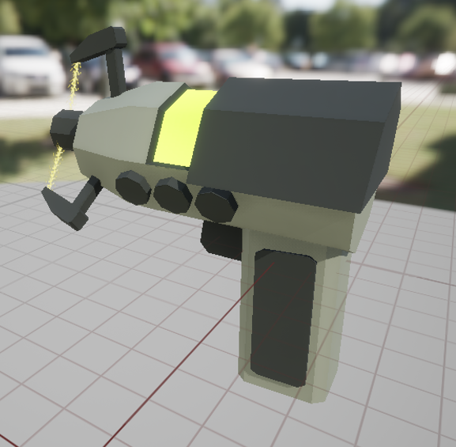
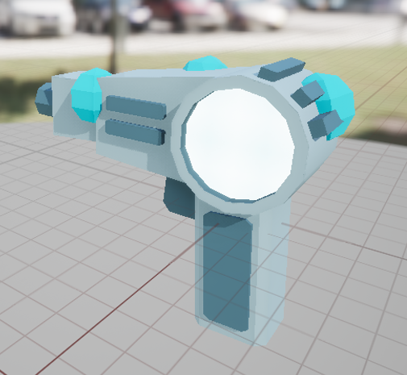
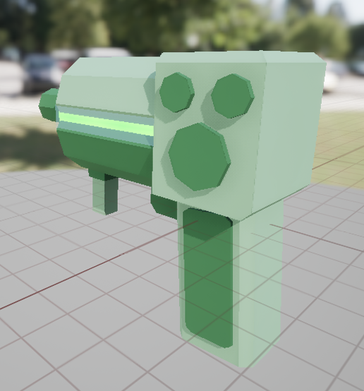

# Week 4

### Aim Lag Visor + Crosshair
To recreate the HUD having a lag effect, I created a Widget actor to use instead of the widget I had on the player's viewport. I set it to move to the player camera's view every tick, and added a spring arm with rotation lag so the HUD would lag slightly, which required I go back and make a new HUD with a larger size so more of it would be visible when it swayed, instead of visibly cutting off.

### Fixed Tunnel Camera

How To Make A Spline-Based Side-Scroller Camera In Unreal Engine (2023) At: https://www.youtube.com/watch?v=ZmIzHtglnMM (Accessed  21/10/2024).

### Face Reflection
The next feature I wanted to have was the player's face reflecting on the visor if they were in close proximity to a missile explosion.
I took a photo of my face to use as a prototype face proof of concept.

## Beginning the process of removing the Nintendo assets
During the standup for this week, I reflected on what I had created so far, and realised I was slowly exhausting the ideas I had for the different mechanics, though one large thought was brought up which I had been figuring for a while; that Nintendo could *probably* sue me if I published the game on Itch.io, especially since a lot of the mechanics I was making are directly inspired by the mechanics from Metroid Prime. So a large hurdle I now had to tackle was making it so that wouldn't happen, I had to retheme the game and make it something unique.

I made a table of what needed to be replaced, that way I could keep track of what needed to be changed;

| Asset | Asset Description |
| ------ | ------ |
| Morph Ball | The Morph Ball needs to be replaced with something new, possibly changing the mechanics |
| Arm Cannon | The Player's arm cannon could be switched out with multiple weapons instead of an arm cannon to make it less comparable |
| Wave Beam | I could retexture and change the wave beam particle effects to change it into arcs of electricity to make it different. |
| HUD | The HUD needs to be retextured and reorganised to change it as currently it is copying the general layout from Metroid Prime, I could potentially keep the lagging aspect if I retheme it |

So I began brainstorming, my immediate thoughts were directed at the Morph Ball, as that ability is a staple of the metroid series, I needed a way to have a mechanic similar to that, without being a direct copy. I remembered some old Newgrounds flash games I used to play, one of which being Slime Labs; that has the player rolling around and platforming as a slime ball, squeezing through vents, and navigating the environment. So I had a great idea; to retheme the player character into a slime humanoid, and turn the morph ball into the player reforming back into their original slime ball form, allowing them to roll around and fit into smaller gaps that they couldn't normally.

---
### New Morph-Ball: The Slimeball
I used a material I had created last year for the technical art unit, where the mesh's faces extrude towards nearby surfaces to replicate the extrusion a slime ball would face when pushed against the ground. It did this by using a combination of a "distance to nearest surface" node, a "VertexNormalWS" node, and several other math-ey nodes.

<iframe src="https://blueprintue.com/render/q7kj54jb/" scrolling="no" allowfullscreen></iframe>

---
After creating the slimeball material, I changed the image of the face reflection to one I drew which better resembled a slime.

## Replacing the Weapons
My focus was now on the weapons. I had to split the power beam into 4 unique weapons and also alter what they do to make them unique instead of copying Metroid Prime.

### Power Beam
I decided to change the power beam into a basic sci-fi energy pistol.
I created a basic mesh in Maya to demonstrate what I was aiming for. As the general idea for the new weapon system was multiple different looking guns instead of an arm cannon that transformed between 4 different states.

After that I simply swapped out the arm cannon for the new mesh, and changed the projectile to a blue cylinder.

---
### Wave Beam
For the Wave Beam I created a sciency electric gun that has different prongs chanelling electricity into the center. I changed the properties of the gun so it quickly fired while holding down left click.

---
### Ice Beam
For the Ice Beam, I created a gun that was based around chanelling cryogenic energy in the back, which is then fired out of the barrel in the form of condensed ice bricks which explode on contact with walls and freeze enemies.
The projectile was therefore kept largely the same as there was no need to change anything.

---
### Plasma Beam
The Plasma beam saw the most drastic change, I changed it so it fires arcing globules of acidic goop that bounce on walls before exploding dealing splash damage.

---
### Missile Launcher
For the missile launcher, I thought the best solution was to have the rocket launcher be a seperate part of the player's arsenal that they can use independently to the weapons.

I based the new rocket launcher off of Doom Eternal, which has a shoulder-mounted rocket launcher. So I moved a mesh into the top left corner of the player's view and set that to be the origin point of where missiles are shot from.

---
### Switching Guns
With the new weapons created, I changed the script for swapping weapons so instead of changing an enumerator to swap an animation state, it would directly swap the mesh and play an animation of the player drawing a new gun.

<iframe src="https://blueprintue.com/render/_c3e_gb3/" scrolling="no" allowfullscreen></iframe>