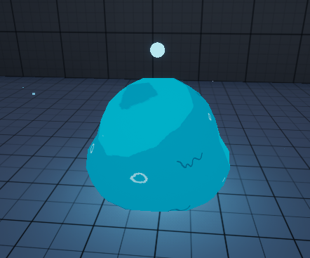
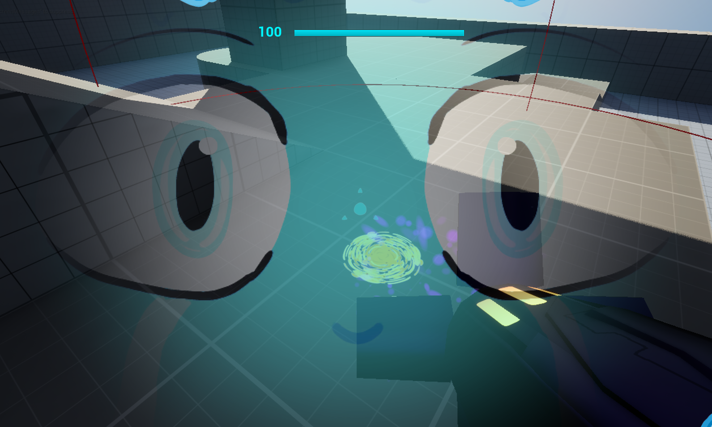

# Week 4

## Class Weekly Task


Full Code:
```
using System;
using System.Collections.Generic;

// The DialogueNode class represents a single dialogue option in the tree
public class DialogueNode
{
    public string DialogueText { get; set; }      // The dialogue text for the node
    public List<DialogueChoice> Choices { get; set; }  // Choices for the player to make

    // Constructor for initializing dialogue nodes
    public DialogueNode(string dialogueText)
    {
        DialogueText = dialogueText;
        Choices = new List<DialogueChoice>();  // Initialize the list of choices
    }

    // Method to add a choice to this node
    public void AddChoice(string choiceText, DialogueNode nextNode)
    {
        Choices.Add(new DialogueChoice(choiceText, nextNode));
    }
}

// The DialogueChoice class represents a player's choice and the resulting dialogue node
public class DialogueChoice
{
    public string ChoiceText { get; set; }  // Text of the player's choice
    public DialogueNode NextNode { get; set; }  // The next dialogue node based on the player's choice

    // Constructor for initializing a choice
    public DialogueChoice(string choiceText, DialogueNode nextNode)
    {
        ChoiceText = choiceText;
        NextNode = nextNode;
    }
}

// The DialogueSystem class represents the overall dialogue system
public class DialogueSystem
{
    public DialogueNode RootNode { get; private set; }  // The starting point of the conversation
    private DialogueNode CurrentNode;  // Tracks the current node in the conversation

    // Constructor that sets the root node
    public DialogueSystem(DialogueNode rootNode)
    {
        RootNode = rootNode;
        CurrentNode = rootNode;  // Start at the root node
    }

    // Method to build the dialogue tree
    public void BuildDialogueTree()
    {
        // Example of building the dialogue tree:
        DialogueNode introduction = new DialogueNode("Hello! How can I help you today?");
        DialogueNode weather = new DialogueNode("The weather is great! It's sunny outside.");
        DialogueNode directions = new DialogueNode("You need to head north and then turn left.");
        DialogueNode goodfarewell = new DialogueNode("Goodbye! Have a nice day.");
        DialogueNode badfarewell = new DialogueNode("bye. Have a day.");

        // Add choices to the root node
        introduction.AddChoice("Tell me about the weather.", weather);
        introduction.AddChoice("I need directions.", directions);
        introduction.AddChoice("Nothing, just passing by.", badfarewell);

        // Add choices to the weather node
        weather.AddChoice("Thanks!", goodfarewell);

        // Add choices to the directions node
        directions.AddChoice("Thanks for the directions!", goodfarewell);

        // Now, set the root node in the DialogueSystem to the introduction
        RootNode = introduction;
        CurrentNode = RootNode; // Reset the current node to the root after building the tree
    }
// Method to start the dialogue
    public void StartDialogue()
    {
        while (true)
        {
            // Display the current node's dialogue text
            Console.Clear();
            Console.WriteLine(CurrentNode.DialogueText);

            // If there are no choices, end the conversation
            if (CurrentNode.Choices.Count == 0)
            {
                Console.WriteLine("End of conversation.");
                break;
            }

            // Display the player's choices
            Console.WriteLine("\nChoose an option:");
            for (int i = 0; i < CurrentNode.Choices.Count; i++)
            {
                Console.WriteLine($"{i + 1}. {CurrentNode.Choices[i].ChoiceText}");
            }

            // Get the player's choice
            int choice = 0;
            while (choice < 1  choice > CurrentNode.Choices.Count)
            {
                Console.Write("Enter the number of your choice: ");
                bool isValidChoice = int.TryParse(Console.ReadLine(), out choice);

                if (!isValidChoice  choice < 1 || choice > CurrentNode.Choices.Count)
                {
                    Console.WriteLine("Invalid choice. Please try again.");
                }
            }

            // Navigate to the next dialogue node based on the player's choice
            CurrentNode = CurrentNode.Choices[choice - 1].NextNode;
        }
    }
}

// The Program class starts the dialogue system
public class Program
{
    public static void Main(string[] args)
    {
        // Build the dialogue tree and start the dialogue
        DialogueSystem dialogueSystem = new DialogueSystem(null);  // Initialize with null, will set RootNode later
        dialogueSystem.BuildDialogueTree();  // Build the dialogue structure
        dialogueSystem.StartDialogue();      // Start navigating through the dialogue
    }
}
```

## Project Development

### Aim Lag Visor
To recreate the HUD having a lag effect, I created a Widget actor to use instead of the widget I had on the player's viewport. I set it to move to the player camera's view every tick, and added a spring arm with rotation lag so the HUD would lag slightly, which required I go back and make a new HUD with a larger size so more of it would be visible when it swayed, instead of visibly cutting off.


### Clamp Look Speed

### Crosshair

### Fixed Tunnel Camera

Spline-Based Camera Position (Accessed on 21/10/24)
https://www.youtube.com/watch?v=ZmIzHtglnMM

### Additions to Ice Beam


### Face Reflection
The next feature I wanted to have was the player's face reflecting on the visor if they were in close proximity to a missile explosion.

## Beginning the process of De-Nintendo-ifying the game.
During the standup for this week, I reflected on what I had created so far, and realised I was slowly exhausting the ideas I had for the different mechanics, though one large thought was brought up which I had been figuring for a while; that Nintendo could *probably* sue me if I published the game on Itch.io, especially since a lot of the mechanics I was making are directly inspired by the mechanics from Metroid Prime. So a large hurdle I now had to tackle was making it so that wouldn't happen, I had to retheme the game and make it something unique.

I made a table of what needed to be replaced, that way I could keep track of what needed to be changed;

| Asset | Asset Description |
| ------ | ------ |
| Morph Ball | The Morph Ball needs to be replaced with something new, possibly changing the mechanics |
| Arm Cannon | The Player's arm cannon could be switched out with multiple weapons instead of an arm cannon to make it less comparable |
| Wave Beam | I could retexture and change the wave beam particle effects to change it into arcs of electricity to make it different. |
| HUD | The HUD needs to be retextured and reorganised to change it as currently it is copying the general layout from Metroid Prime, I could potentially keep the lagging aspect if I retheme it |

So I began brainstorming, my immediate thoughts were directed at the Morph Ball, as that ability is a staple of the metroid series, I needed a way to have a mechanic similar to that, without being a direct copy. I remembered some old Newgrounds flash games I used to play, one of which being Slime Labs; that has the player rolling around and platforming as a slime ball, squeezing through vents, and navigating the environment. So I had a great idea; to retheme the player character into a slime humanoid, and turn the morph ball into the player reforming back into their original slime ball form, allowing them to roll around and fit into smaller gaps that they couldn't normally.




After creating the slime ball, I made a new texture for the visor reflection to match the new character.



## Weapon time boiiiiiii
My focus was now on the weapons. I had to split the power beam into 4 unique weapons and also alter what they do to make them unique instead of copying Metroid Prime.

### Power Beam

### Wave Beam

### Ice Beam

### Plasma Beam

### Missile Launcher
The missile launcher was a tricky one as it was available regardless of your currently selected weapon. Though I very quickly thought of a way to circumvent this issue.

Doom Eternal has a shoulder-mounted rocket launcher that is seperate from the rest of your arsenal that you can use at a moment's notice.