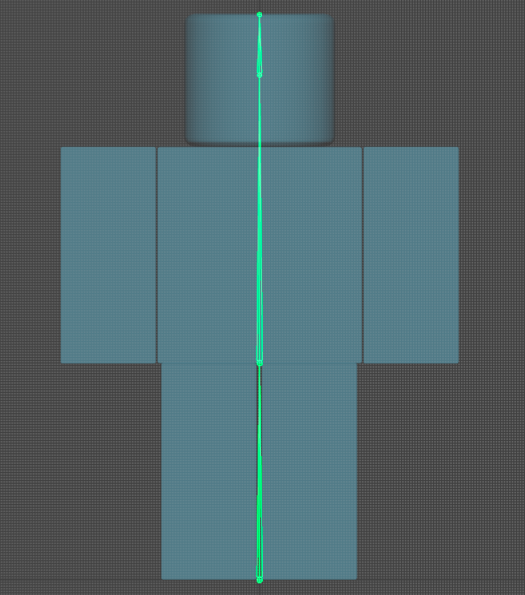

# Week 5

## First Build
Our lecturer requested we create a build of our project, as we should be doing that regularly. My first build turned out okay except for strange visual flickering on the player's guns, which I fixed by enabling VSync in the game's configuration as it also caused a lot of visual tearing on the default unreal grid material I was using.

## New Mesh and Walk Cycle
Liam was wandering around the class, and when he looked at my project, suggested I make the walk cycle look more slime-ey, as currently it looked like a regular human walking, and not a slime sloshing around. So I decided to change that by making my own custom mesh.
I designed the proportions after a roblox character, but it didn't matter too much since you were nver going to be able to see the player's mesh, it was simply to use for first person animations such as the walk cycle.
I created, rigged and animated the mesh in Maya, and then swapped it out as the new character mesh.

