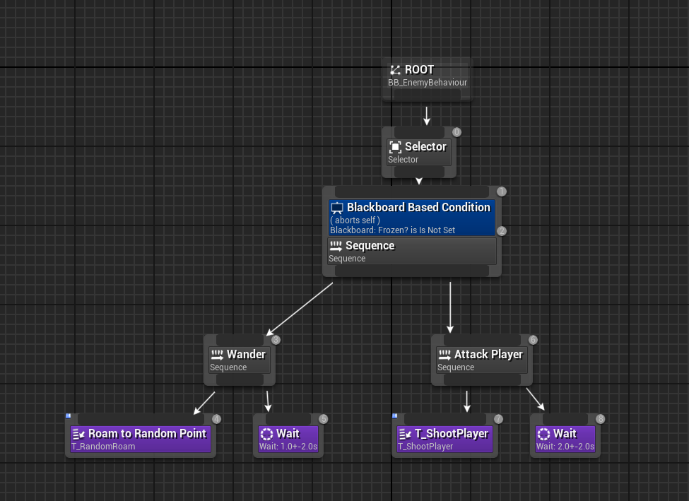

https://forums.unrealengine.com/t/edge-glow-applying-to-entire-surface/127918
I read this link and found the word "Fresnel", so I inputted that into the material node and it gave me exactly what i wanted yaaay!

https://www.raylib.com/

## Lesson Task: Data Driven movement system

# Week 6

## Project Development

Since I finished changing the art assets to make my game unique, I wanted to move away from the art aspect of my project to continue focusing on the devlelopment of the mechanics over the next two weeks. I had three primary mechanics I wanted to add, that being the Inventory System, Enemy AI, and Environmental Objects such as Doors and Lab Vents.

### Enemy AI
I first chose to further develop the Enemy AI so it could actually move and attack the player.

I created a behaviour tree, and two task nodes. One task node was set to wander to a random point, and the other made the enemy shoot 3 projectiles at the player.

### Water
I created a box collision that, when the player entered, set a flag that the player was underwater. In the player character's event tick, I would activate a node that damaged the player every second they were in the water.

<iframe src="https://blueprintue.com/render/yrtw-8ir/" scrolling="no" allowfullscreen></iframe>

### Rope Swinging
I wanted a system where the player could swing on ropes. It was intially part of my feature creep, but I had finished all of the ideas I wanted to add.
I experimented with physics-based cable systems, but they didn't work properly with what I wanted to do.

When the player is in range of a hook, they must press and hold E. It will then create a hook actor, which will repeatedly swing the player back and forth in a simulated swing animation.
When the player releases E, they will be launched in the direction they are currently swinging.

<iframe src="https://blueprintue.com/render/nypmyf39/" scrolling="no" allowfullscreen></iframe>

---