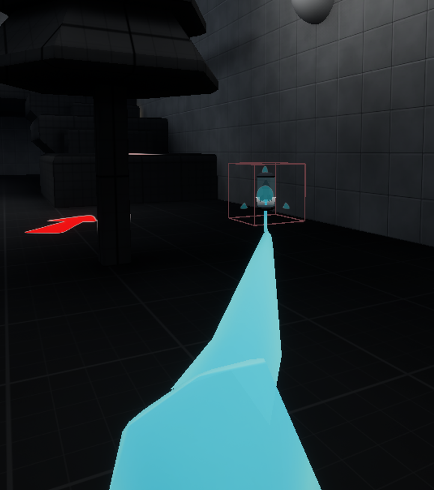

# Week 7

### Items
I wanted to create pickups the player could collect to restore both energy and also missiles. So I created a static mesh with a box collision attached. I also created a boolean value which would swap the mesh and grab function between health and missiles.

<iframe src="https://blueprintue.com/render/fdbz_7dl/" scrolling="no" allowfullscreen></iframe>

When the player was in FPS mode, I also had it cast to the player mesh to play a grab animation where the player appears to grab the ammo before stashing it over their shoulder.
The animation would be skipped in Slimeball mode since the player is in third person.

<iframe src="https://blueprintue.com/render/q2e7-fse/" scrolling="no" allowfullscreen></iframe>

---
### Slimegrab
I wanted to add a system that replicated the mechanic from Half-Life: Alyx where the player can grab ammo and health pickups from long range. To do this I first created a line cast node from the player character. I then created a blueprint interface to place on the consumables so that the player can grab them.

<iframe src="https://blueprintue.com/render/c2o26uza/" scrolling="no" allowfullscreen></iframe>

After that, I created the grab code in the consumable item. The main node is a 'suggest projectile velocity custom arc' node, calculating how to launch from the item's location to the players. It then launches the item by the calculated impulse.

I then added a second visual node that plays a grab animation, and spawns a cable component that attaches itself to both the ammo and the player's hand, thus giving the appearance of a slime tendril firing from the player's hand to grab the ammo from long range.

<iframe src="https://blueprintue.com/render/adsg_4od/" scrolling="no" allowfullscreen></iframe>

---
### Spindash

### Door

### Inventory System