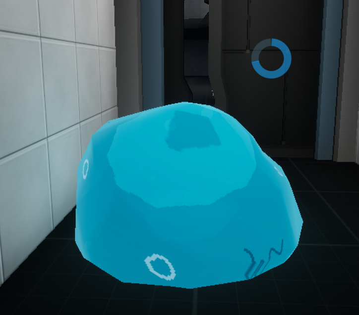
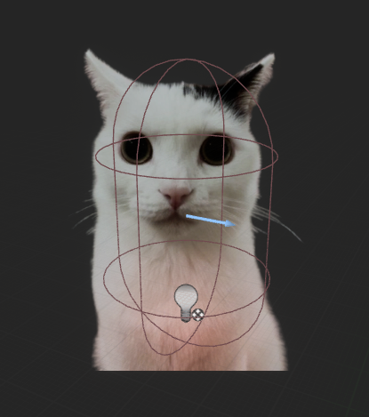
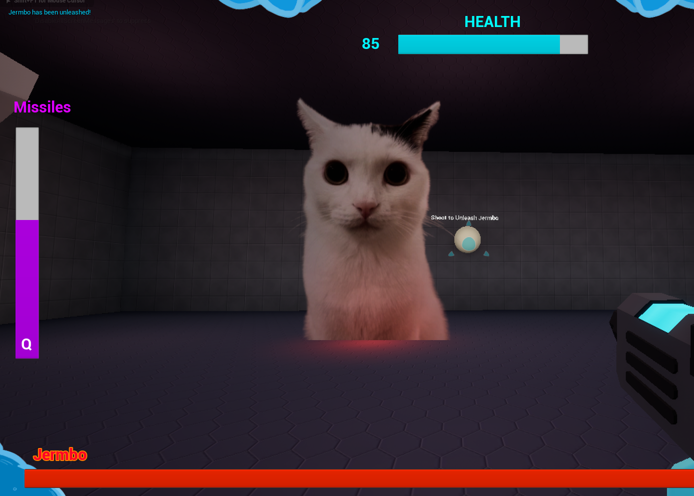

# Week 8
This week was about getting people to test our games. Students were bribed with biscuits to come and test our games. So it was a very good opportunity to recieve feedback about many aspects of the game.

## Testing Feedback

| Category | Feedback |
| --- | --- |
| Slimeball | Fun to use, the added movement abilities are nice. However the player may end up overusing the ability due to how much better it is at movement. Therefore it may be better to make it a time-limited ability or make the slimeball state the default, and have the guns be activated |
| Controls | Movement in the FPS state is too slow, some control aren't explained very well (Locking on to enemies and rope swinging), level is too open-ended so the player might not be able to experience everything. |
| Progression | The player is able to skip certain segments when in the slimeball ability due to how fast it is, so important mechanics should be taught to the player in a way where they can't accidentally skip them |
| Rope Swing | Fun to get right, but many players struggled with getting the timing for activating it right, and also didn't know that you had to hold down E, so they would activate the rope swing, then immediately stop swinging. Which lead into another complaint that since the first rope swing could be skipped, the next "first" tutorial was over a bottomless pit that killed the player, which was a fairly harsh punishment for failing on the second try. |

With this feedback in mind, I set off to fix some of the bigger issues that players had with my game.

## Making the Slimeball a timed ability.
In order to make the slimeball a timed ability, I created a collapsed node graph attached to the event tick which, whilst the player was in the slimeball state, drain a float variable until it reached 0. Then, after reaching 0, it would attempt to force the player out of the slimeball state. 

Initially it would force the player back into FPS mode even when hiding in tunnels, so I changed the script so when attempting to exit the slimeball state, it wouldn't do so if the player was hiding in a tunnel, it would only force them out after they left the tunnel.

<iframe src="https://blueprintue.com/render/hrs-uxca/" scrolling="no" allowfullscreen></iframe>

I then created a circular progress bar in the player's widget that tracks the player's energy, so the player has a visual indicator of how long they have left before they exit slimeball mode.

## Boss Fight
To give the testers an objective, I created a boss arena, and a boss enemy. The boss in question was originally just a larger version of the AI but with more health. I took inspiration from Ross using Maxwell in his project and decided to swap out the boss' mesh for a PNG image of Jermbo, an image of a cat.

The only main differences were that you couldn't freeze Jermbo, and instead of dying immediately, it starts a timeline that causes Jermbo to explode violently for about 3 seconds before disappearing.

When testing the game, viewers seemed to enjoy the sudden, dramatic appearance of a cat PNG that started quickly moving around the boss arena and attacking the player, so I got some favourable feedback regarding Jermbo.

## Win Screen
When Jermbo died, I wanted that to be the win-state for the player, so in the death script after Jermbo was done exploding, I had him create a widget of the win screen.

<iframe src="https://blueprintue.com/render/6gb4wjga/" scrolling="no" allowfullscreen></iframe>